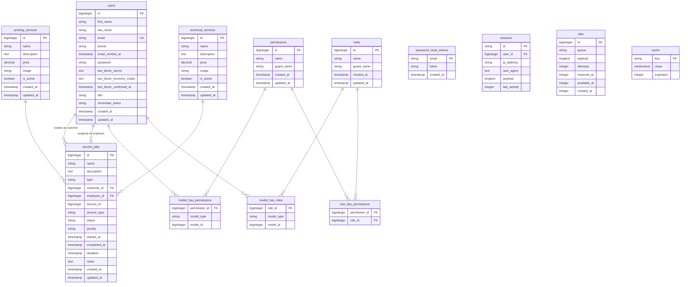

# Database Schema

## Entity Relationship Diagram

## Table Descriptions

### users
Stores user accounts including customers and staff (printing/technical). Includes two-factor authentication support and staff title classification.

### printing_services
Catalog of printing services offered with pricing and availability status.

### technical_services
Catalog of technical services offered with pricing and availability status.

### service_jobs
Service requests/jobs linking customers to services, with employee assignments, status tracking, and priority management.

### permissions
Spatie Laravel Permission package - defines granular permissions.

### roles
Spatie Laravel Permission package - defines user roles.

### model_has_permissions
Pivot table linking permissions to models (polymorphic).

### model_has_roles
Pivot table linking roles to models (polymorphic).

### role_has_permissions
Pivot table linking roles to permissions.

### password_reset_tokens
Laravel default - stores password reset tokens.

### sessions
Laravel default - stores user session data.

### jobs
Laravel default - queue job storage.

### cache
Laravel default - cache storage.

## Relationships

- **users → service_jobs**: One user can create multiple service jobs (as customer) and be assigned to multiple jobs (as employee)
- **printing_services → service_jobs**: One printing service can be referenced by multiple service jobs
- **technical_services → service_jobs**: One technical service can be referenced by multiple service jobs
- **users → model_has_roles**: Users can have multiple roles
- **roles → model_has_roles**: Roles can be assigned to multiple users
- **roles → role_has_permissions**: Roles can have multiple permissions
- **permissions → role_has_permissions**: Permissions can be assigned to multiple roles
- **permissions → model_has_permissions**: Permissions can be directly assigned to models
